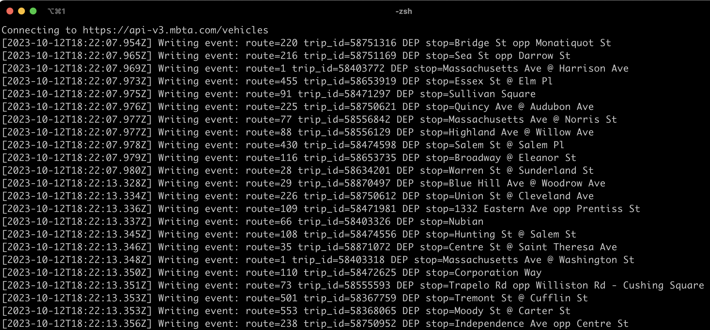

# gobble




Gobble is a service that reads the [MBTA V3 Streaming API](https://www.mbta.com/developers/v3-api/streaming) for all train/bus events, and writes them out to a format that can be understood by the [TransitMatters Data Dashboard](https://github.com/transitmatters/t-performance-dash).

## Requirements to develop locally

- Python 3.12
- [poetry](https://python-poetry.org/)

## Development Instructions

1. Duplicate `config/template.json` into `config/local.json`, and change the null out with your MBTA V3 API key.
2. In the root directory, run `poetry install` to install dependencies
3. Run `poetry run python3 src/gobble.py` to start.
4. Output will be in `data/` in your current working directory. Good luck!

### Linting

You can run the linter against any code changes with the following commands

```bash
$ poetry run flake8 src
$ poetry run black --check src
```

## Support TransitMatters

If you've found this app helpful or interesting, please consider [donating](https://transitmatters.org/donate) to TransitMatters to help support our mission to provide data-driven advocacy for a more reliable, sustainable, and equitable transit system in Metropolitan Boston.
