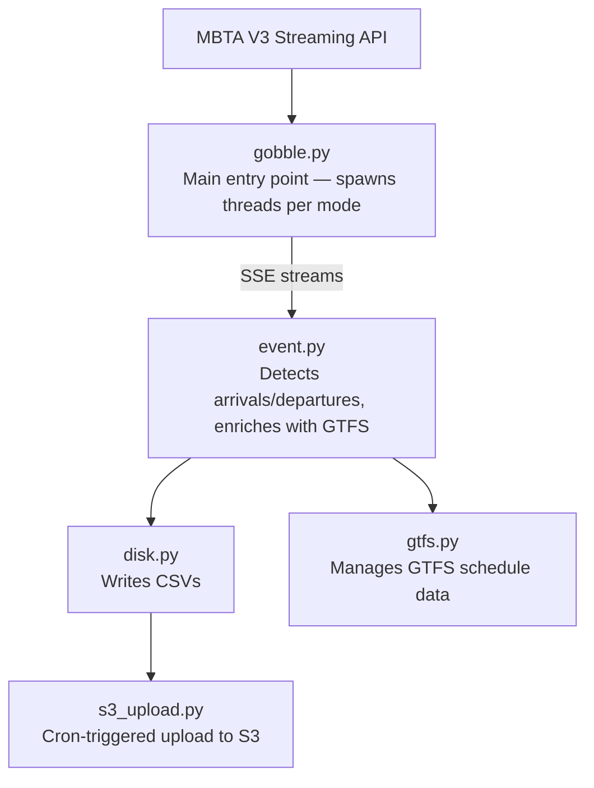

# Architecture

## Overview

Gobble is a multi-threaded Python service that streams real-time vehicle data from the MBTA, detects meaningful transit events, and writes enriched data to disk for upload to S3.

## Threading model

Gobble spawns one thread per transit mode group:

| Thread                                         | Routes                                                               |
| ---------------------------------------------- | -------------------------------------------------------------------- |
| `rapid_routes`                                 | All rapid transit lines (Red, Blue, Orange, Green-B/C/D/E, Mattapan) |
| `cr_routes`                                    | All commuter rail lines                                              |
| `routes_bus_chunk0`, `routes_bus_chunk10`, ... | Bus routes in chunks of 10 (MBTA API limitation)                     |

Each thread runs `client_thread()`, which maintains a persistent SSE connection that automatically reconnects on failure.

A separate daemon thread (`update_gtfs`) runs in the background to refresh GTFS schedule data when the service date changes (around 3 AM Eastern).

## Event detection

Gobble detects two types of events by comparing successive vehicle updates:

- **Arrival (ARR)**: The vehicle's status changes to `STOPPED_AT` and the previous event was a departure (`DEP`).
- **Departure (DEP)**: The vehicle's stop ID changes and the stop sequence has advanced.

Each event processing thread maintains its own `TripsStateManager` to track per-trip state. State is persisted to JSON files in `data/trip_states/` so it survives restarts.

## GTFS enrichment

After detecting an event, Gobble enriches it with schedule data:

1. Looks up the nearest scheduled arrival at the same stop using `merge_asof` (time-based matching)
2. Calculates **scheduled headway** — time since the previous scheduled arrival at this stop
3. Matches the real-time trip to a scheduled trip and calculates **scheduled travel time** — time since the trip's first stop

GTFS archives are automatically downloaded from the [MBTA CDN](https://cdn.mbta.com/archive/) and cached locally in `data/gtfs_archives/`.

## Service date concept

The MBTA defines a "service date" as running from 3:00 AM to 2:59 AM the next day, rather than midnight to midnight. Gobble uses this convention throughout — events between midnight and 3 AM are attributed to the previous day's service.

## S3 upload

`s3_upload.py` runs as a separate process (triggered by cron every 30 minutes in production). It:

1. Finds all CSV files for today's service date
2. Compresses each file with gzip
3. Uploads to the `tm-mbta-performance` S3 bucket under the `Events-live/` prefix

## Monitoring

When `DATADOG_TRACE_ENABLED` is set to `true`, Gobble reports:

- APM traces for key functions (via `@tracer.wrap()` decorators)
- JSON-formatted logs for Datadog log aggregation
- Exception details with stack traces
